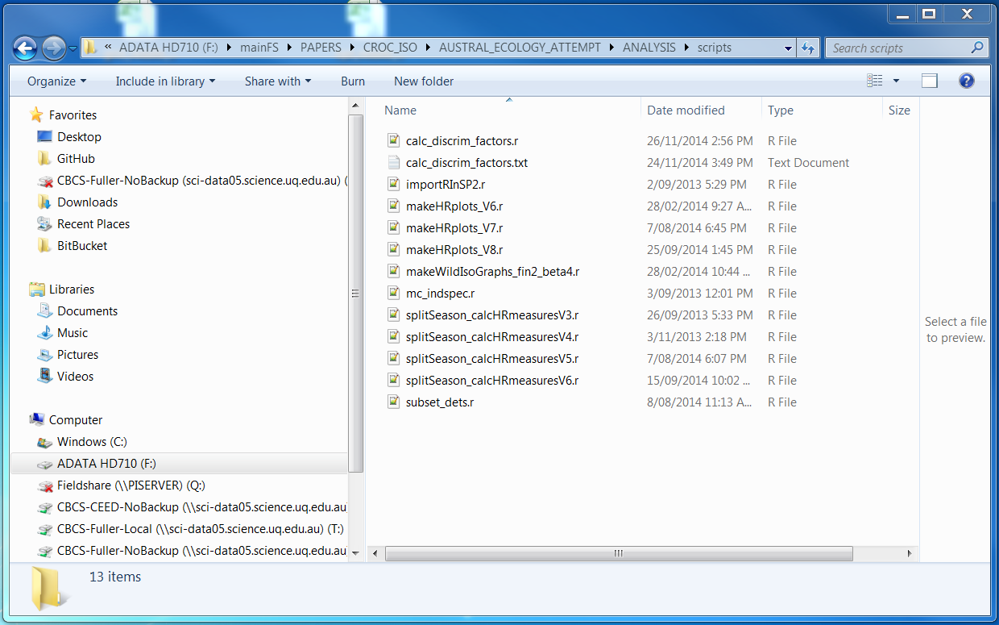

## What is version control?

* System that records changes to a file so you can recall specific versions at a late date

--- 

## Why use version control?

--- 

## Why use version control?

* complete history of files
* backup projects to the cloud
* switch between different versions
* accomodate multiple people working on the project

--- 

## Popular systems

* Git
	+ more popular
	+ can do more complicated stuff
	+ we will use this one
* Mercurial
	+ simpler

--- 

## Popular Git Systems 

* GitHub
	+ unlimited free repositories
	+ use this for your open source projects
	+ integration with tools for R package development
	+ 2 GB repository size
* Bitbucket
	+ unilimited free/private repositories
	+ use this for your research projects

---

## Demo

Let's demo the GitHub Gui application
 
--- 

